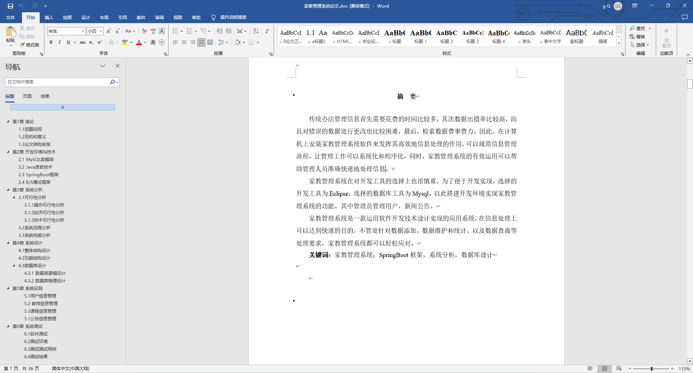
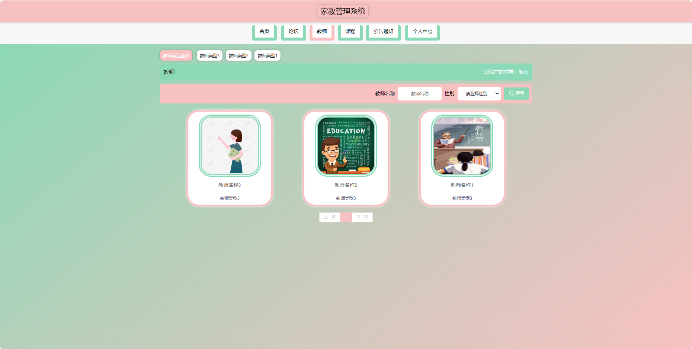
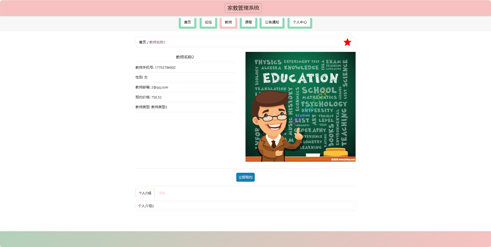
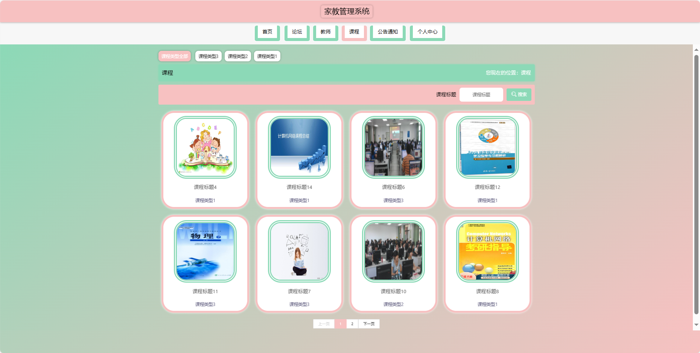
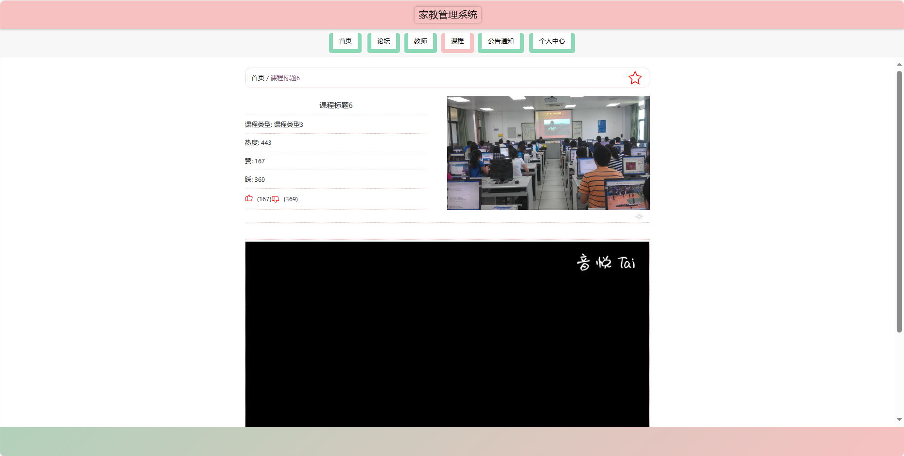
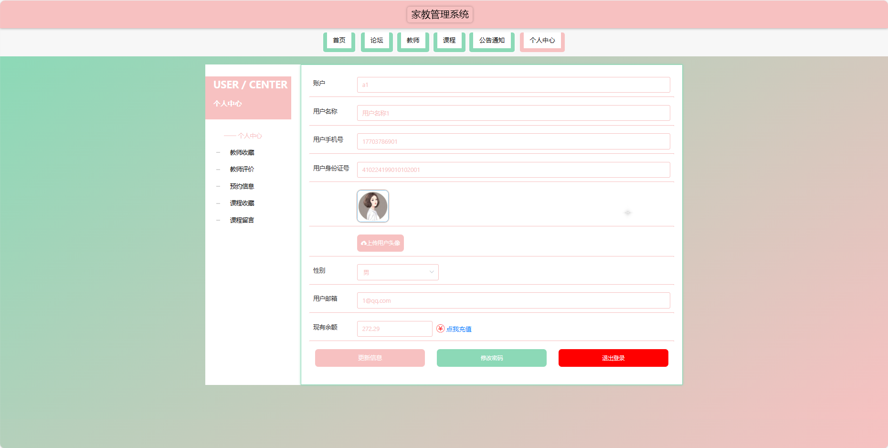
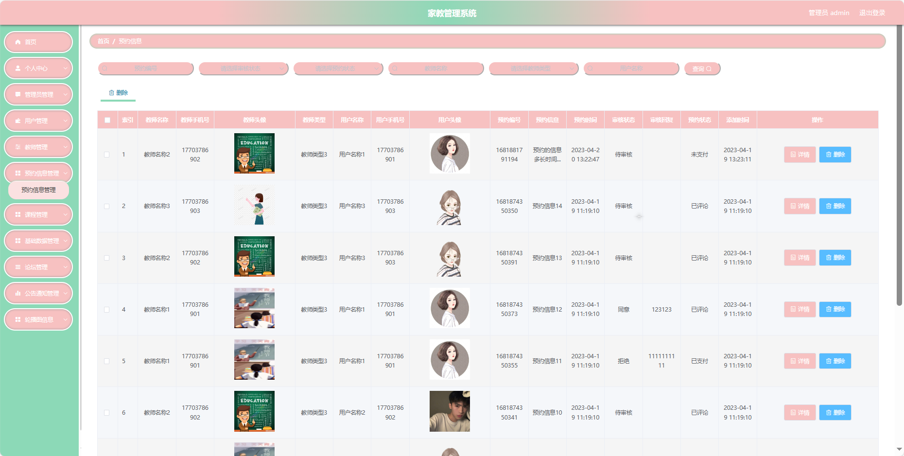
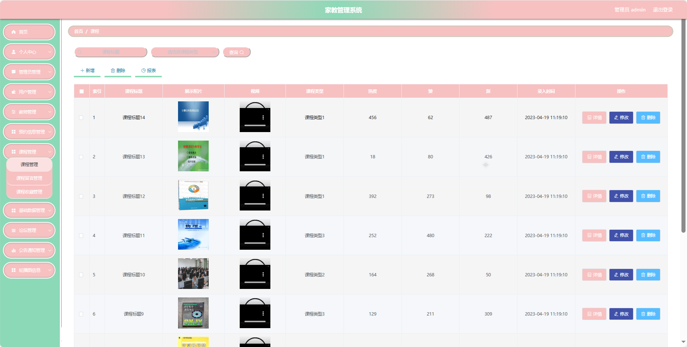

## 基于SpringBoot的家教管理系统(程序+报告)

###  获取sql数据库文件: 从戎源码网 (https://armycodes.com/) QQ: 386869957 QQ群: 377586148
###  所有系统地址: (https://github.com/YuLin-Coder/AllProjectCatalog) 
###  所有项目以及源代码本人均调试运行无问题 可支持远程安装部署调试、定制修改、代码讲解

## 项目介绍
基于SpringBoot的家教管理系统，系统包含三种角色：管理员、用户,教师主要功能如下。

【用户功能】
1. **首页：** 浏览家教管理系统的主要信息。
2. **论坛：** 参与用户间的交流和讨论。
3. **教师：** 查看教师列表。
4. **课程：** 浏览和选择适合的课程。
5. **公告通知：** 获取系统发布的重要通知和公告。
6. **个人中心：** 管理个人信息，包括修改密码等。

【管理员功能】
1. **首页：** 查看家教管理系统的整体。
2. **个人中心：** 修改密码、管理个人信息。
3. **管理员管理：** 审核和管理注册管理员用户的信息。
4. **用户管理：** 审核和管理注册用户的信息。
5. **教师管理：** 管理教师信息，包括评价和收藏管理。
6. **预约信息管理：** 查看和管理用户对教师的预约信息。
7. **课程管理：** 管理课程信息，包括留言和收藏管理。
8. **基础数据管理：** 管理系统的基础数据，包括教师类型、课程类型、公告类型等。
9. **论坛管理：** 管理用户间的讨论和交流。
10. **公告通知管理：** 发布、编辑和删除公告通知。
11. **轮播图信息：** 管理系统首页的轮播图。

【教师功能】
1. **首页：** 查看个人信息和系统通知。
2. **个人中心：** 修改密码、管理个人信息。
3. **教师管理：** 查看教师评价和收藏信息。
4. **预约信息管理：** 查看用户对教师的预约信息。
5. **课程管理：** 管理个人的课程信息，包括留言管理。
6. **论坛管理：** 参与论坛的讨论和交流。
7. **公告通知管理：** 查看系统发布的公告通知。

## 项目技术
- 编程语言：Java
- 数据库：MySQL
- 项目管理工具：Maven
- 前端技术：HTML、CSS、JavaScript、Jquery、Vue
- 后端技术：Spring、SpringMVC、MyBatis

## 运行环境
- JDK版本：JDK1.8及以上
- 开发工具：IDEA、Ecplise、Myecplise都可以
- 数据库: MySQL5.7及以上
- Maven：maven3.0及以上
- Node：14.14.0及以上

## 运行截图

